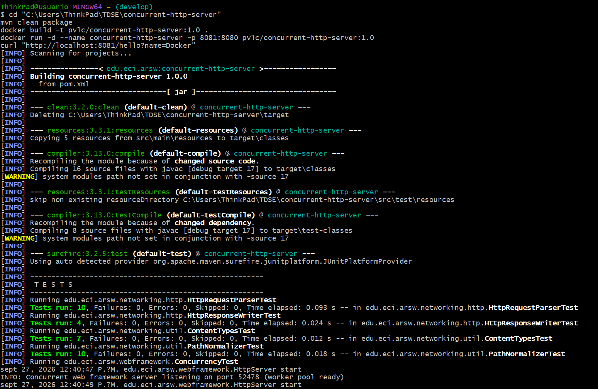
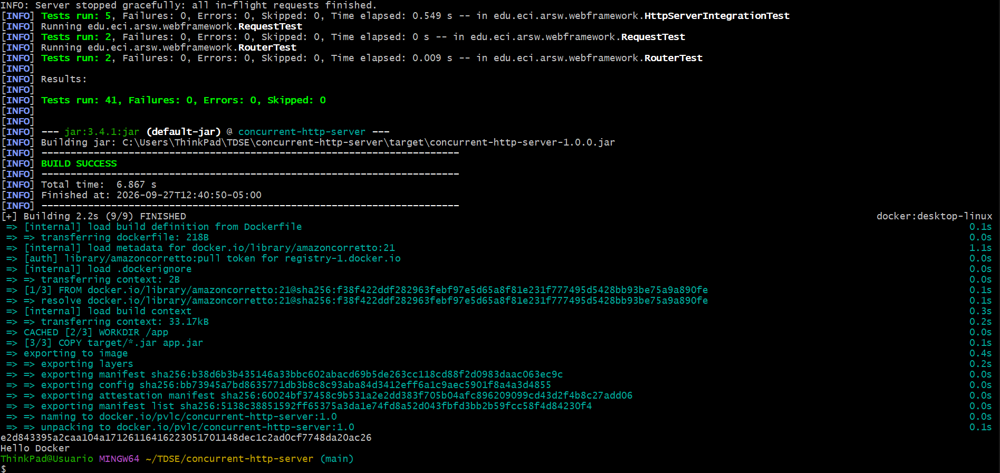
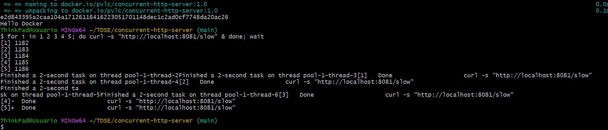
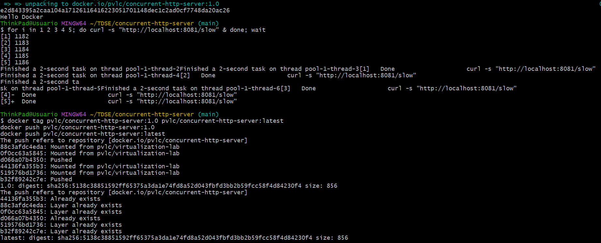
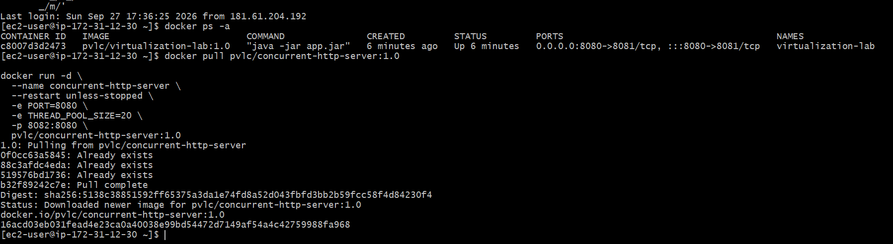
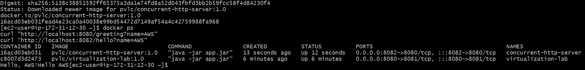
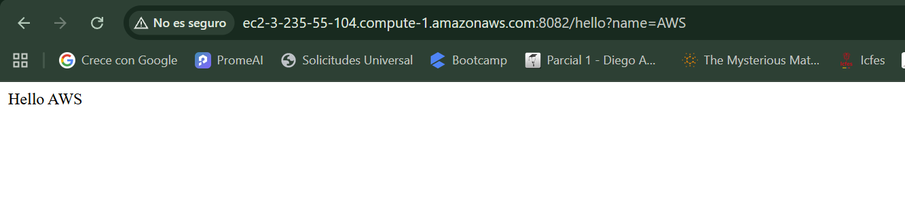

# concurrent-http-server

This is an extension of **maintainable-application-server**, a small Java web framework built
directly on top of a raw `ServerSocket`, with no outside framework involved (no Spring, no Netty).
This repository takes that framework and adds what the *Containerizing and Deploying a Java Web
Application* workshop asks for on top of what it already had.

## 1. Current state of the framework

`maintainable-application-server` already let a developer register `GET` routes as lambdas, serve
static files, read query parameters, and configure the server through environment variables
(`PORT`, `APP_ENV`). The one thing it did not do well was handle more than one client at a time.
`HttpServer` accepted a connection, handled it completely, and only then went back to accept the
next one, so a slow request made every other client wait in line behind it.

## 2. What changed in this extension

| Requirement | Before | After |
|---|---|---|
| **Concurrent request handling** | `HttpServer` accepted one connection, handled it fully, then accepted the next one. | The accept loop now only accepts a socket and hands it off to a fixed **thread pool** (`Executors.newFixedThreadPool`). Several clients get served at the same time. The pool size can be set with `THREAD_POOL_SIZE` (20 by default). |
| **Graceful shutdown** | Stopping the server worked because the loop was sequential, so it only had to check a flag once the single active request was done. | `stop()` now closes the listening `ServerSocket` directly, which unblocks the accept loop right away without taking new work. Then the thread pool is shut down with `awaitTermination`, so every request that is already running gets to finish (up to a 10 second timeout) before the process exits. This is more important now, since the pool runs work outside the accept loop. |
| **Port from an environment variable** | Already there (`PORT`, 8080 by default). | Same as before. `THREAD_POOL_SIZE` follows the same idea. |
| **Runs in a Docker container** | Not set up. The earlier deployment used systemd directly on the instance. | New `Dockerfile`, based on `amazoncorretto:21`, the same pattern used in the Spring Boot workshop repository. |
| **Deploys on EC2** | Deployed before through systemd (see `maintainable-application-server`'s own README). | Now deployed as a Docker container on EC2, see [section 6](#6-aws-ec2-deployment). |

The routing, static file serving, HTTP parsing and writing, and the request/response classes are
carried over as they were from `maintainable-application-server`. Only `HttpServer` (the accept
loop) and `WebFramework` (pool size setting) changed.

### Architecture

```
edu.eci.arsw.app
    Application            → registers the routes and the static files folder
edu.eci.arsw.webframework
    WebFramework            → static entry point: staticfiles(), get(), start(), stop()
    Router / RouteHandler   → maps a path to a lambda handler
    Request / Response      → simple wrappers the lambda works with
    HttpServer               → accepts connections, hands each one to a worker thread pool,
                                shuts down gracefully
    StaticFileService        → serves a file from the configured static files folder
edu.eci.arsw.networking.http
    HttpRequest/HttpResponse/HttpRequestParser/HttpResponseWriter → low level HTTP code,
    kept as it was from the networking lab this framework started from
```

### A route to show the concurrency change

`GET /slow` waits about 2 seconds before answering, on purpose. Hitting it from several clients at
once and seeing them all come back in roughly the same 2 second window, instead of one after
another, is the easiest way to see the thread pool actually working. The automated test suite
checks the same thing without needing a stopwatch, see below.

## 3. Build and run locally

Needs JDK 17+ and Maven.

```bash
mvn clean package
java -jar target/concurrent-http-server-1.0.0.jar
```

The server starts on port `8080` by default. You can set it up like this:

```bash
PORT=8081 THREAD_POOL_SIZE=50 GREETING_PREFIX=Hola java -jar target/concurrent-http-server-1.0.0.jar
```

Try the concurrency out yourself. Send several requests at once and watch them all come back
around the same time instead of one by one:

```bash
for i in 1 2 3 4 5; do curl -s "http://localhost:8080/slow" & done; wait
```

Run the tests:

```bash
mvn test
```

`ConcurrencyTest` starts a real server, fires several requests at a blocking route from separate
client threads, and checks that the whole batch finishes in much less time than handling them one
after another would take. It is an automated way to prove the requests run at the same time,
instead of just eyeballing timestamps.

## 4. Environment variables

| Variable | Purpose | Default |
|---|---|---|
| `PORT` | Port the server listens on | `8080` |
| `THREAD_POOL_SIZE` | How many worker threads handle connections at once | `20` |
| `GREETING_PREFIX` | Prefix used by the `/hello` route | `Hello` |
| `APP_ENV` | `/shutdown` only gets registered when this is `development` | `development` |

## 5. Docker

Build, run and test it locally:

```bash
mvn clean package
docker build -t pvlc/concurrent-http-server:1.0 .
docker run -d --name concurrent-http-server -p 8081:8080 pvlc/concurrent-http-server:1.0
curl "http://localhost:8081/hello?name=Docker"
```




Same concurrency test as before, now against the containerized version:

```bash
for i in 1 2 3 4 5; do curl -s "http://localhost:8081/slow" & done; wait
```



`APP_ENV` is set to `production` by default inside the image (see the `Dockerfile`), so `/shutdown`
is disabled by default in containers. Only turn it on for local debugging with `-e APP_ENV=development`.

### Docker Hub

**Repository:** [hub.docker.com/r/pvlc/concurrent-http-server](https://hub.docker.com/r/pvlc/concurrent-http-server)

```bash
docker tag pvlc/concurrent-http-server:1.0 pvlc/concurrent-http-server:latest
docker push pvlc/concurrent-http-server:1.0
docker push pvlc/concurrent-http-server:latest
```



## 6. AWS EC2 deployment

Same instance and approach as the Spring Boot workshop repository: Amazon Linux 2023, Docker
installed on the instance, the published image pulled and run as a container. This app runs on the
same EC2 instance as `virtualization-lab`, just on a different host port (8082), so there is only
one instance to pay for.

```bash
docker pull pvlc/concurrent-http-server:1.0

docker run -d \
  --name concurrent-http-server \
  --restart unless-stopped \
  -e PORT=8080 \
  -e THREAD_POOL_SIZE=20 \
  -p 8082:8080 \
  pvlc/concurrent-http-server:1.0
```



Checking both containers running on the same instance:

```bash
docker ps
curl "http://localhost:8080/greeting?name=AWS"
curl "http://localhost:8082/hello?name=AWS"
```



**Public deployment URL:** `http://ec2-3-235-55-104.compute-1.amazonaws.com:8082/hello?name=AWS`



## 7. Evidence of progress

This repository's commit history shows the extension work directly, see
[the commit history on GitHub](https://github.com/Valentina-33/concurrent-http-server/commits/main),
mainly the commit that adds concurrent request handling and graceful shutdown to
`HttpServer`/`WebFramework`, plus the `ConcurrencyTest` that proves it works.

| Requirement | Status |
|---|---|
| Concurrent request handling | Done. Fixed worker thread pool, checked by `ConcurrencyTest` and by the manual demo above |
| Graceful server shutdown | Done. Requests already running get to finish before the process exits |
| Port from an environment variable | Kept from the base framework (`PORT`) |
| Runs in a Docker container | Done. `Dockerfile` added, builds and runs locally and in Docker Hub |
| Deploys on AWS EC2 | Done. Running next to `virtualization-lab` on the same instance, port 8082 |
